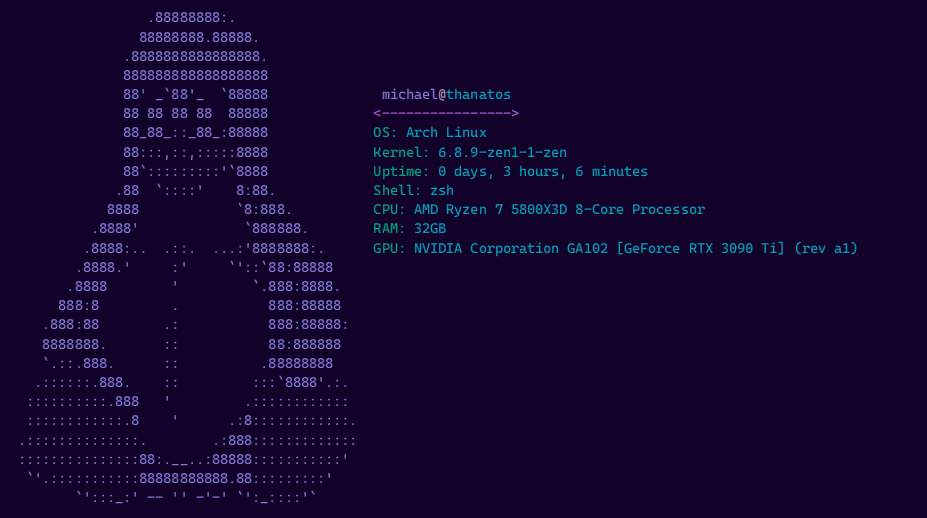

# BTW

Simple fetcher written in C



## Installation

1. Clone this repostitory
```
git clone https://github.com/MichaelLF107/btw.git
```

2. Run the make command
```
make
```

3. Move the `main` file to any directory
